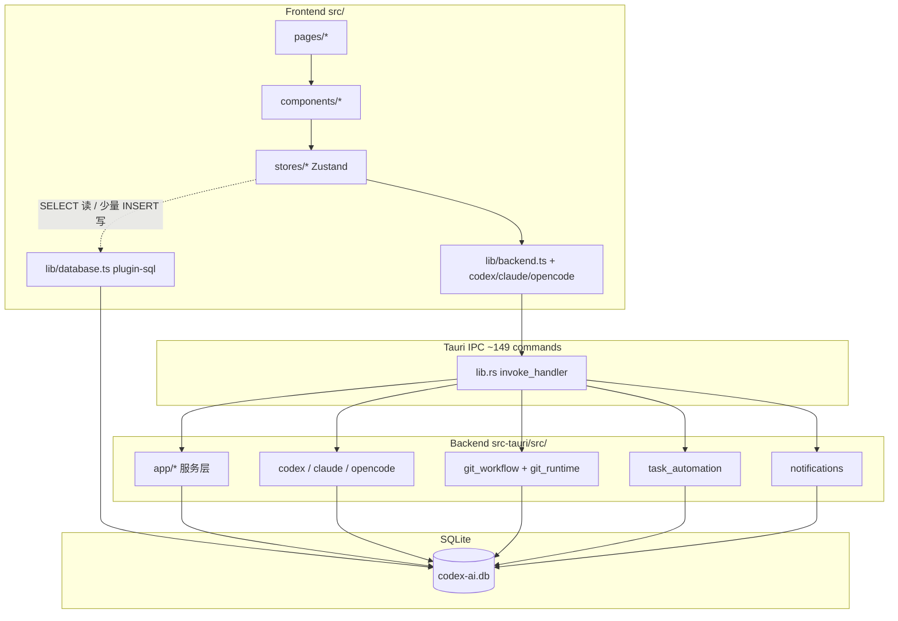

# 00 · 架构全景报告

> 分析日期：2026-07-16 · 版本：0.4.0 · 证据驱动

## 1. 一句话

**Codex AI** 是本地桌面「AI 协作控制台」：用 Tauri 模块化单体管理项目/任务/员工，驱动 Codex / Claude / OpenCode 三引擎执行，并集成 Git worktree、代码审查、自动质控与 SSH 远程执行。

## 2. 技术栈基线

| 层 | 技术 | 版本线索 |
|----|------|----------|
| 前端 | React 19 + TypeScript + Vite 7 + Tailwind 4 + Zustand 5 + Monaco | `package.json` |
| 桌面壳 | Tauri 2（tray / dialog / notification / shell / sql / opener） | `Cargo.toml` |
| 后端 | Rust 2021 + Tokio + SQLx 0.8（SQLite） | `src-tauri` |
| 数据 | `sqlite:codex-ai.db`，40 版迁移 | `db/migrations.rs` |
| 进程桥 | Node `.mjs` SDK bridge（Codex / Claude / OpenCode / Git） | `src-tauri/src/*/bridge*.mjs` |

## 3. 分层与数据流



### 目标边界（ADR-0001）

1. 业务**写路径**应收口到 Rust Tauri commands  
2. 前端 store **只缓存、交互、调 command**  
3. `employees.project_id` 为员工-项目唯一来源  
4. 会话落库 `codex_sessions` / `codex_session_events`  
5. 启动前校验工作目录 + Git 仓库  

### 实际边界状态（2026-07-16）

| 项 | 状态 | 证据 |
|----|------|------|
| CRUD 任务/项目/员工写 | ✅ 走 Rust | `app/tasks.rs` 等 + `backend.ts` |
| 前端直接 SELECT 读 | ⚠️ 大量存在 | `dashboardStore` / `taskStore` / `employeeStore` / `projectStore` |
| 前端直接 INSERT 写 | ❌ **边界违规** | `projectStore.ts` 写 `activity_logs`；`GlobalSearchDialog.tsx` 写搜索跳转日志 |
| SQL 插件权限 | ⚠️ 前端可 execute | `capabilities/default.json`：`sql:allow-execute` |
| 会话落库 | ✅ | migrations v14+、`sessions.rs` |
| 三引擎 Manager | ✅ 启动注入 | `lib.rs` setup |

> **结论**：架构意图清晰，但「读路径」仍混用 plugin-sql；「写路径」有少量 activity 日志泄漏，未完全符合 ADR。

## 4. 模块地图

### 4.1 后端

| 模块 | 路径 | 职责 | 规模 |
|------|------|------|------|
| 应用服务 | `app/{projects,tasks,employees,sessions,review,remote,database,delivery,shared}` | 业务校验、CRUD、DTO | 中–大 |
| Git | `git_workflow.rs` + `git_runtime.rs` | 暂存/分支/worktree/任务上下文/高风险确认 | **最大 ~5.5k** |
| 自动化 | `task_automation.rs` | review_fix_loop_v1 + resume | ~2.9k |
| Codex | `codex/` | CLI/SDK、AI 命令、设置、密钥 | 大 |
| Claude | `claude/` | SDK 会话 | 中 |
| OpenCode | `opencode/` | SDK server + 会话 | 大 |
| 通知 | `notifications.rs` | sticky/one-time/dedupe | 中 |
| DB | `db/{migrations,models}` | 40 migrations + 模型 | ~2.7k |
| 壳 | `tray` / `window_*` | 托盘、尺寸、关闭隐藏 | 小 |

### 4.2 前端

| 区域 | 路径 | 说明 |
|------|------|------|
| 路由 | `App.tsx` | 8 页 + 路由持久化 + 全局快捷键 |
| 状态 | `stores/*` | 6 个 Zustand store |
| IPC 封装 | `lib/backend.ts` + 引擎 lib | 主契约层 |
| 领域 UI | `components/{tasks,projects,git,sessions,employees,settings,dashboard}` | 按领域拆分 |
| 基础 UI | `components/ui/*` | shadcn / Base UI |

### 4.3 页面路由

| 路径 | 页面 |
|------|------|
| `/` | Dashboard |
| `/projects`, `/projects/:id` | 项目列表 / 详情（Git 重） |
| `/kanban` | 看板 + 任务详情 |
| `/sessions` | 会话管理 |
| `/employees` | AI 员工 |
| `/settings` | 运行时 / Git 自动化 / SSH / 数据库 |
| `/trash` | 回收站 |

## 5. 启动装配（`lib.rs`）

1. 注入 SQL migrations → `sqlite:codex-ai.db`  
2. 插件：shell / dialog / notification / opener  
3. 创建 tray；注入 `CodexManager` / `ClaudeManager` / `OpenCodeManager`  
4. 恢复窗口尺寸  
5. debug 下打印 DB 启动状态  
6. **`spawn_resume_pending_automation`** — 恢复未完成自动质控  
7. **OpenCode SDK server on startup**  
8. 注册 149 个 commands  

## 6. 核心业务主路径

```
创建项目(local|ssh) → 创建员工(绑定 provider)
  → 创建任务(assignee/reviewer/coordinator, worktree?)
  → prepare_task_git_execution
  → start_{codex|claude|opencode}
  → 会话 events + file changes
  → (可选) start_task_code_review
  → (可选) review_fix_loop_v1 自动修复轮次
  → commit / merge worktree
  → task completed + metrics + notifications
```

## 7. 架构优势

- 能力闭环完整：任务 → AI 执行 → 审查 → 自动修复 → Git  
- 三引擎统一会话模型（表名仍叫 codex_*，但已含 `ai_provider`）  
- SSH 作为一等执行目标，而非事后补丁  
- 通知中心有独立事件矩阵文档  

## 8. 架构风险摘要

1. **双数据访问路径**：IPC 写 + plugin-sql 读写并存，事务与权限难统一  
2. **超大模块**：`git_workflow` / `task_automation` / 引擎 process 认知与回归成本极高  
3. **DTO 手工镜像**：`models.rs` ↔ `types.ts`，无 codegen  
4. **capabilities 过宽**：前端 `sql:allow-execute` 削弱服务层边界  
5. **测试覆盖偏窄**：仅 Rust 集成测试 ~1.6k LOC，无前端测试  

详见 [05-quality-risks.md](./05-quality-risks.md)、[06-tech-debt-roadmap.md](./06-tech-debt-roadmap.md)。

## 9. 相关文档

- ADR：`docs/adr/0001-modular-monolith-and-rust-service-layer.md`  
- 通知矩阵：`docs/notification-center-event-matrix.md`  
- 本系列：`01`–`06`
