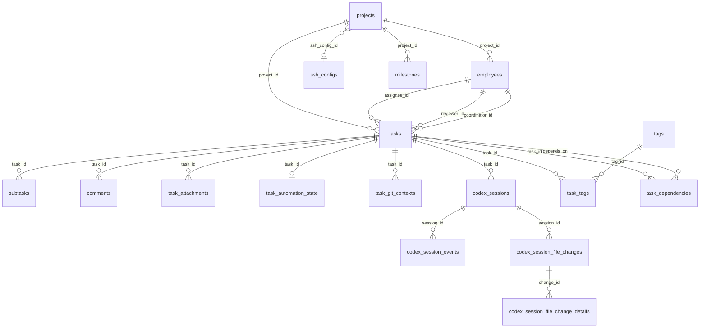

# 02 · 数据模型与迁移审计

## 1. 迁移总览

- **文件**：`src-tauri/src/db/migrations.rs`（~1344 行）  
- **版本**：1 → **40**（共 40 个 Up migration）  
- **模型**：`src-tauri/src/db/models.rs`（~1381 行）  
- **前端镜像**：`src/lib/types.ts`（~1103 行）  

## 2. 迁移时间线（摘要）

| 版本 | 描述 | 领域 |
|------|------|------|
| 1–7 | projects / employees / tasks / subtasks / comments / activity / metrics | 核心 |
| 8–9 | project_employees + indexes | 旧关联（后废弃读取） |
| 10–11 | triggers + seed | 基建 |
| 12–13 | employee model / last session on tasks | 运行时 |
| 14–15 | codex_sessions + events + indexes | 会话 |
| 16 | 回填 employee.project_id | **ADR 迁移** |
| 17 | task_attachments | 附件 |
| 18 | review session + reviewer | 审查 |
| 19–21 | session file changes + details | diff |
| 22 | task automation state | 自动质控 |
| 23–24 | SSH projects + artifact modes | 远程 |
| 25 | task_git_contexts | Git 绑定 |
| 26–27 | model normalize + worktree 偏好 | |
| 28–29 | notifications | 通知中心 |
| 30 | archived index | 归档 |
| 31–33 | ai_provider + Claude thinking budget | 多引擎 |
| 34–35 | coordinator/plan + 默认 prompt | 角色 |
| 36 | 任务计时字段 | 计时 |
| 37–38 | soft delete tasks/projects | 回收站 |
| 39 | dashboard indexes | 性能 |
| 40 | milestones / tags / dependencies | 交付管理 |

## 3. 表清单（CREATE TABLE 出现）

| 表 | 角色 |
|----|------|
| `projects` | 项目（含 type、ssh_config、软删） |
| `employees` | AI 员工（project_id 归属） |
| `project_employees` | **历史表**，ADR 后不再作为写路径 |
| `tasks` | 任务（状态机、角色、自动化、计时、软删） |
| `subtasks` | 子任务 |
| `comments` | 评论 |
| `activity_logs` | 活动日志 |
| `employee_metrics` | 绩效 |
| `task_attachments` | 附件元数据 |
| `codex_sessions` | 统一会话（含 execution_target、ai_provider） |
| `codex_session_events` | 会话事件流 |
| `codex_session_file_changes` | 文件变更摘要 |
| `codex_session_file_change_details` | diff 明细 |
| `task_automation_state` | 自动质控运行时 |
| `task_git_contexts` | 任务 Git/worktree 上下文 |
| `ssh_configs` | SSH 配置 |
| `notifications` | 通知中心 |
| `milestones` | 里程碑 |
| `tags` / `task_tags` | 标签 |
| `task_dependencies` | 任务依赖 |

> 迁移中出现过 `codex_sessions_new` 类重建痕迹，属演进过程表。

## 4. ER 关系（逻辑）

## 5. 关键不变量与约束审计

| 不变量 | 状态 | 说明 |
|--------|------|------|
| 员工归属 = `employees.project_id` | ✅ 设计成立 | v16 回填；索引 `idx_employees_project_id` |
| `project_employees` 停写 | ⚠️ 需确认无残留写 | 表仍在库中 |
| 任务软删 `deleted_at` | ✅ v37–38 | 回收站查询 |
| 会话多引擎 | ✅ `ai_provider` v31–32 | 表名历史遗留 codex_* |
| 自动化 phase 持久化 | ✅ `task_automation_state` | resume 依赖 |
| 通知 dedupe | ✅ | `idx_notifications_active_dedupe` |

## 6. 索引概况

约 **58** 个索引，覆盖：

- activity（action/created/project/task/employee）  
- sessions（status/employee/task/execution_target/ssh）  
- tasks（assignee/completed/deleted 等）  
- notifications、git contexts、dependencies  

Dashboard 查询在 v39 有针对性优化。

## 7. DTO 一致性风险

| 风险 | 说明 |
|------|------|
| 双端手工维护 | Rust `models.rs` + TS `types.ts` |
| 命名转换 | Rust snake_case ↔ 前端；部分 Raw* normalize 在 `backend.ts` |
| 字段漂移 | 新增列易只改一端；无 schema 测试 |
| 前端直读 SQL | store 的 `SELECT *` 依赖列与 `types` 一致，**绕过** models 序列化 |

## 8. 孤儿数据 / 一致性风险

1. **附件**：DB 有 `task_attachments.path`，文件在本地/远程目录；永久删除任务需清理文件（`review` cleanup helpers）  
2. **密钥**：SSH 密码/密钥可能走 `secret_store`，SQL backup **不一定**包含密钥材料（`UNVERIFIED` 完整范围）  
3. **会话 vs 进程**：DB status 与 Manager 内存态可能短暂不一致；automation resume 有 orphan recovery  
4. **Git context**：worktree 目录被外部删除后需 `reconcile_task_git_context`  
5. **project_employees 遗留行**：历史数据可能与 project_id 不一致  

## 9. 备份 / 恢复

| 能力 | Command | 范围 |
|------|---------|------|
| SQL 备份导出 | `backup_database` | 数据库脚本 |
| 恢复 | `restore_database` | 含保护性备份前缀 |
| 打开目录 | `open_database_folder` | |
| 附件/worktree/密钥 | — | **不在**纯 SQL 备份语义内 |

## 10. 迁移风险评级

| 风险 | 级别 | 说明 |
|------|------|------|
| 40 版线性迁移无 down | 中 | 桌面可接受；回滚靠 backup |
| 大表 `ALTER tasks` 多次 | 低–中 | SQLite 可接受 |
| seed 数据 v11 | 低 | 仅首次 |
| 模型列表强制 normalize v26 | 中 | 可能改写用户自定义 model 字符串 |
| 前端 SQL 与迁移不同步 | **高** | store 硬编码 SQL，迁移加列后 SELECT * 尚可，但过滤条件可能漏软删等 |

## 11. 建议（分析级，不实施）

1. 冻结「前端 execute」；activity 写全部改 IPC  
2. 读路径逐步改为 query commands（或保留只读 plugin-sql，但禁止 execute 权限）  
3. 为 `models`/`types` 增加契约测试或 JSON schema  
4. 备份文档明确：附件目录、密钥、worktree 需额外策略  
5. 评估删除或只读化 `project_employees`
