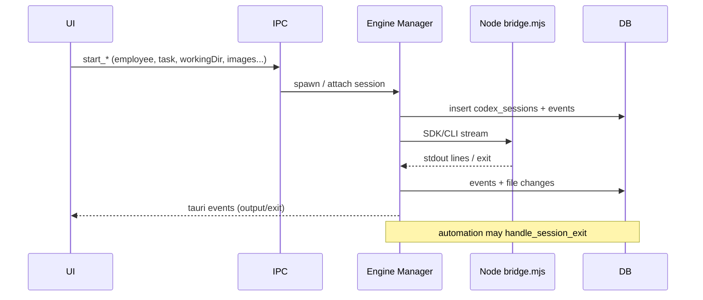

# 04 · 运行时与进程生命周期

## 1. 进程与状态持有者

| Manager | 注入方式 | 模块 |
|---------|----------|------|
| `CodexManager` | `Arc<Mutex<_>>` | `codex/manager.rs` |
| `ClaudeManager` | `Arc<tokio::Mutex<_>>` | `claude/manager.rs` |
| `OpenCodeManager` | `Arc<tokio::Mutex<_>>` | `opencode/manager.rs` |

启动副作用（`lib.rs`）：

1. `task_automation::spawn_resume_pending_automation`  
2. `opencode::spawn_opencode_sdk_server_on_startup`  

## 2. 会话统一数据模型

尽管表名历史为 `codex_*`，运行时会话统一写入：

- `codex_sessions`：员工、任务、kind、status、execution_target、ssh_config、ai_provider、thinking_budget…  
- `codex_session_events`：流式事件  
- `codex_session_file_changes` + `_details`：变更与 diff  

会话 kind 覆盖：普通执行、审查、修复、继续对话等（见 models / session 代码）。

## 3. 启动前校验

本地路径：

- `validate_project_repo_path` / `validate_runtime_working_dir`  
- Git 仓库要求存在 `.git`（`git_workflow` 与引擎 context 多处）  

SSH：

- 选中 `ssh_configs`  
- 远程 shell / 路径 join / SDK runtime layout（`app/remote.rs`）  
- artifact capture mode 决定 diff 完整度  

## 4. 引擎生命周期对比

| 阶段 | Codex | Claude | OpenCode |
|------|-------|--------|----------|
| start | ✅ | ✅ | ✅ |
| stream events | ✅ | ✅ | ✅ |
| stop employee / session | ✅ | ✅ | ✅ |
| restart | ✅ | ❌ | ❌ |
| stdin send | ✅ | ❌ | ❌ |
| resume | start 参数 + prepare preview | start 参数 | start 参数 |
| 常驻服务 | 否 | 否 | **是**（SDK server） |

## 5. 任务执行与 Git 上下文

典型任务运行：

1. `prepare_task_git_execution` → 创建/复用 worktree 与 `task_git_contexts`  
2. 引擎 start（带 `taskGitContextId` / `workingDir`）  
3. 退出时写 file changes（受 capture mode 限制）  
4. 可选 review / automation  
5. commit / merge / cleanup  

漂移处理：`refresh_task_git_context` / `reconcile_task_git_context`。

## 6. 代码审查生命周期

入口：`start_task_code_review`（`app/review.rs`）

1. 收集任务 + git 上下文（diff / untracked，有字符与文件数上限）  
2. 构造 review prompt（含图片附件过滤）  
3. 启动审查会话（kind=review）  
4. 解析 verdict 标签/JSON  
5. 写 activity：`task_review_*`  
6. 通知：review_pending 等  

SSH：附件 sync 到远程目录再给模型。

## 7. 自动质控 `review_fix_loop_v1`

### 7.1 配置

来自 Codex/应用设置（`load_task_automation_policy`）：

- 开关、最大修复轮次（默认逻辑 max≥1）  
- 失败策略：阻塞 vs 转人工  

任务级：`tasks.automation_mode` + `task_automation_state.phase`。

### 7.2 阶段（常量于 shared / automation）

常见 phase：

- `launching_review` / `waiting_review`  
- `launching_fix` / `waiting_execution`  
- `committing_code`  
- 终态：`completed` / `blocked` / `manual_control` 等  

### 7.3 驱动点

| 触发 | 行为 |
|------|------|
| 会话退出 | `handle_session_exit` / `handle_session_exit_blocking` |
| App 启动 | `resume_pending_automation`：replay 未消费 exit + 恢复 pending phase |
| 用户 | `restart_task_automation` / `set_task_automation_mode` |
| 提交成功 | `mark_task_automation_commit_completed` |

### 7.4 风险点

1. **幂等**：resume + replay exit 需避免双开审查/修复（代码有 orphan running session recovery）  
2. **UI 同步**：前端监听 `task-automation-state-changed`；历史 bug 为按钮与 phase 不一致（TASK 已勾选修复，需回归）  
3. **三引擎**：automation 显式依赖 Codex/Claude manager API；OpenCode 路径完整度需专项验证（`UNVERIFIED`）  
4. **归档守卫**：archived 任务禁用 automation  

## 8. 员工运行时状态

- `get_employee_runtime_status` / `get_codex_session_status`  
- 多会话：员工可绑多任务；UI 用「查看运行终端」聚合  
- 状态 online/busy/offline/error 与真实进程可能短暂不一致  

## 9. 通知与系统同步

- `sync_system_notifications`：SSH 模式、SDK 健康、配置缺失 → sticky  
- 会话失败/完成 → one_time  
- 详见 `docs/notification-center-event-matrix.md`  

## 10. 资源与清理

| 资源 | 清理责任 |
|------|----------|
| 子进程 | Manager stop / kill shell 权限 |
| 会话行 | 保留历史，不随 stop 删除 |
| Worktree 目录 | merge/remove commands + automation cleanup activity |
| 附件文件 | delete task / attachment helpers |
| OpenCode server | 进程级，随 app 生命周期 |

## 11. 体验打磨关注点（选项 C）

1. 会话页：三引擎 resume/stop 状态徽章统一文案  
2. SSH 产物 limited：全局一致 banner，避免仅角落提示  
3. 自动化 phase → 看板按钮禁用态单一数据源（以 `get_task_automation_state` + event 为准）  
4. 长日志流：虚拟列表 / 截断策略，防止 Sessions/终端弹窗卡顿  
